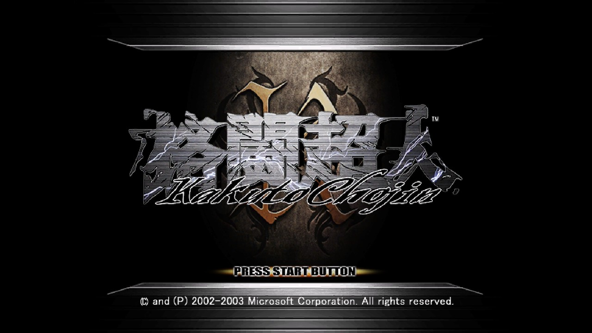
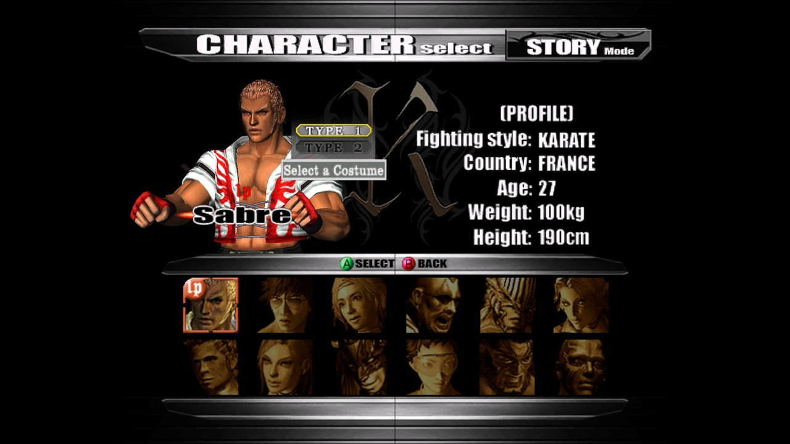
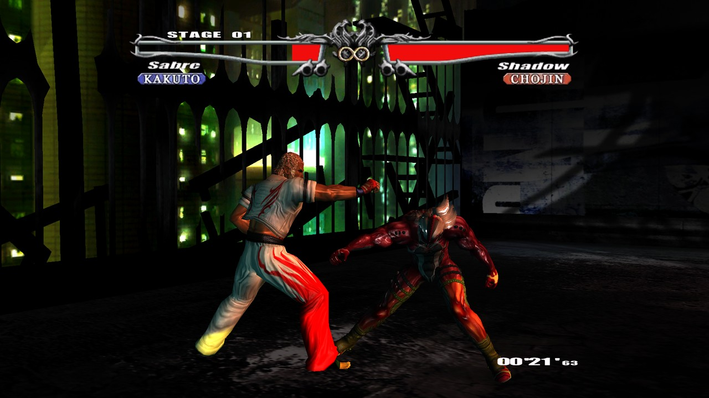

# KakutoChojin-recomp

[English](README.md) | 日本語

<p align="center">
  
  
  
</p>
<p align="center"><sub>日本版、フル HD (1080p) ワイドスクリーン</sub></p>

初代 Xbox 用ソフト『格闘超人 / Kakuto Chojin』を、Windows で動くネイティブのプログラムに変換するツール。
ゲームの x86 機械語を関数単位で C に変換 (リフティング) してコンパイルし、Xbox のカーネル・Direct3D 8・
DirectSound・入力は PC 向けの実装に置き換える。高解像度 (最大 4K)・ワイドスクリーン・ゲームパッドに対応。
Ghidra を使った逆コンパイル (読める C の出力) もできる。

**このリポジトリにはゲームのデータ・コードは含まれていない。** 利用者が自分で所有するディスクから
作成したイメージを使う (利用は自己責任で)。動作確認済みの版については、変換を助ける関数の開始アドレス一覧
(アドレスの数値のみ) を `hints/` に置いている。

## 対応している版

| 版 | ビルド | 状態 |
|---|---|---|
| 北米版 (地域: 全世界) | `3db43286` | 動作確認済み |
| 日本版 | `3dd89b56` | 動作確認済み |

ディスクイメージは redump 形式・xiso 形式のどちらでもよい。上記以外の版は未確認
(変換時に「not tested」と表示される。下記「未確認の版」を参照)。

## 使い方

必要なもの: Windows 10/11 (x64)、インターネット接続 (初回のみ)、ディスクイメージ (`.iso`)。
Visual Studio や Python などのインストールは不要。

1. `convert.bat` に `.iso` をドラッグ＆ドロップする (`.xbe` も可)。
2. ISO の隣に `<名前>_win\` ができる (初回はツールのダウンロードがあるので数分、2 回目以降は 1〜2 分)。
3. `<名前>_win\play.bat` で起動する。最初に画面設定のウィンドウが開く。

### 変換の流れ

1. ツールの準備: 初回だけ、必要なツールを `deps\` にダウンロードする (`tools\setup.ps1`。約 300 MB、
   インストールや管理者権限は不要。C/C++ コンパイラ llvm-mingw、CMake、Ninja、Python と capstone、SDL3、
   XbSymbolDatabase)。各ファイルは SHA-256 で照合する。
2. ディスクからファイルを取り出し、版 (日本版・北米版など) を判別する
3. XDK のライブラリ関数を特定してマニフェストを作る
4. (`--decompile` 指定時のみ) Ghidra で読める C に逆コンパイルする。Ghidra と JDK も自動でダウンロードする (約 700 MB)
5. ゲームのコードを C に変換する
6. Clang でコンパイルしてまとめる

コマンドラインからは `convert.bat <game.iso | default.xbe> [出力フォルダ] [--decompile] [--jobs N]`
(`--jobs` はコンパイルの同時実行数。既定 2)。

### 出力

| ファイル | 内容 |
|---|---|
| `play.bat` | 起動用 |
| `KakutoChojin.exe`, `SDL3.dll` | 変換したゲーム |
| `KakutoChojin.ini` | 画面設定 (起動時のウィンドウで変更でき、ここに保存される) |
| `game\` | ディスクから取り出したファイル (ISO 入力時のみ) |
| `analysis\` | マニフェスト、シンボル、変換した C (`lifted\`)、逆コンパイル結果 (`decomp\`、`--decompile` 時) |
| `hdd\` | Xbox の HDD (セーブデータ)。初回起動時に作成 |
| `KakutoChojin.log` | 実行ログ (問題が起きたときに確認する) |
| `_build\` | コンパイルの中間ファイル (消してよい) |

### 画面設定

起動時のウィンドウで選ぶ (矢印キー / マウス / ゲームパッドで操作、Enter または A で開始)。

| 項目 | 選択肢 |
|---|---|
| 解像度 | 元の 480p / HD (720p) / フル HD (1080p) / WQHD (1440p) / 4K (2160p) |
| 縦横比 | 4:3 (元のまま) / 16:9 ワイドスクリーン |
| 表示 | ウィンドウ / 全画面 (ゲーム中も Alt+Enter または F11 で切り替え) |
| 描画方式 | Direct3D 11 / OpenGL 4.5 |
| このウィンドウ | 毎回表示 / 次から表示しない (`KakutoChojin.ini` の `launcher=1` で戻せる) |

設定は `KakutoChojin.ini` に保存される。直接編集してもよい。

```ini
[video]
resolution=1080   ; 出力の高さ: 0 = 元の 480、720 / 1080 / 1440 / 2160 など
widescreen=1      ; 1 = 16:9
fullscreen=0      ; 1 = ボーダーレス全画面で起動
gpu=d3d11         ; 描画方式: d3d11 / gl (OpenGL 4.5)
launcher=1        ; 1 = 起動時に設定ウィンドウを表示
```

- **高解像度**: 画面を指定の高さで描画する (ゲーム内部の小さな描画先は元の解像度のまま)。
- **ワイドスクリーン**: 3D シーンは左右に広がり、メニュー・HUD・ムービーは中央の 4:3 に収まる。
  元々画面外にあった 2D 要素 (大きな演出文字など) が左右に見えることや、画面端の物体が消えることがある。
- **ウィンドウ**: サイズ変更可。縦横比を保って表示する。

### 操作

ゲームパッド (SDL3 が対応するもの: Xbox 360 / One / Series、DualShock / DualSense、Switch Pro など。最大 4 人、抜き差し・振動対応):

| Xbox | ゲームパッド (Xbox 配置で表記) |
|---|---|
| A / B / X / Y、十字キー、スティック、START、BACK | 同じボタン |
| BLACK / WHITE | RB / LB |
| L / R トリガー | LT / RT |

キーボード (1P、ゲームのウィンドウが前面のとき): 矢印 = 十字キー、Z/X/C/V = A/B/X/Y、A/S = WHITE/BLACK、
Q/W = LT/RT、Enter = START、Backspace = BACK

### 未確認の版

上の表にない版は、変換はできても実行中に止まることがある (変換で関数を見落とした箇所に来ると、
`KakutoChojin.log` に `FATAL: lift: ... to XXXXXXXX` とアドレスが出る)。

- `--decompile` を付けて変換すると、Ghidra で関数を探すので見落としが減る。
- 止まったアドレスを `hints\<タイトルID>_<ビルド>.extra.txt` に 1 行ずつ書き足し、変換し直すと先に進める。

## 開発者向け

### 構成

| 場所 | 内容 |
|---|---|
| `src/lift/kt_lift.h` | 変換した C が使う実行時インターフェース (CPU 状態、ゲストメモリ、x87/MMX/SSE の補助) |
| `src/host/` | ランタイム: カーネル (`kernel*.cpp`、`ob.*`、`hostfs.*`)、D3D8 (`d3d/`)、描画 API 抽象 (`gpu/`: D3D11 / OpenGL)、DirectSound (`dsound/`、`audio/`)、入力 (`xapi/`)、ウィンドウ・起動時設定 (`platform/`)、OS 層 (`os.*`) |
| `tools/convert.py` | 変換の全工程 (`convert.bat` から呼ばれる) |
| `tools/lift/` | x86 → C 変換 (`lift.py`、命令変換 `x86c.py`、MMX/SSE `simd.py`) |
| `tools/ghidra/` | Ghidra 用スクリプト (注釈の適用、命名、型の復元、C 出力) |
| `hints/` | 確認済みの版の関数一覧 (`.functions.txt`) と、ポインタ経由でしか呼ばれない関数 (`.extra.txt`) |

### 仕組み

| 層 | 方式 |
|---|---|
| ゲームのコード | 関数ごとに `void f_XXXXXXXX(KtCpu* c)` という C に変換。レジスタとフラグ (遅延評価) は関数内のローカル変数、ゲストのメモリ・スタック・呼び出し規約は元のまま。対応命令: 整数・x87・MMX・SSE (Pentium III) |
| メモリ | Xbox の 4GB アドレス空間をホスト上に予約し (`guest_mem.cpp`)、`KT_MEMBASE + アドレス` でアクセス |
| xboxkrnl | ハンドル表・イベント・セマフォ・スレッド・待機を自前で実装 (`ob.*`)、ファイルは NT 形式の作成モード・情報クラスを `std::filesystem` 上で再現 (`hostfs.*`)。`\Device\CdRom0` → ゲームフォルダ、`\Device\Harddisk0\PartitionN` → `hdd/` |
| D3D8 | 描画 API 抽象 (`gpu.h`) の上で再実装。NV2A 頂点プログラム・レジスタコンバイナ・固定機能パイプラインを共通のシェーダ方言に変換し、HLSL / GLSL にする |
| DirectSound | 自前のミキサー + SDL3 出力 (Xbox ADPCM デコード付き)。音声デバイスが無くても実時間でミックスしてタイミングを保つ |
| 入力・ウィンドウ | SDL3 |
| 本体設定 | 地域はディスクの証明書に合わせ、DVD 限定起動のタイトルには DVD 認証 (MODE SENSE のセキュリティページ) に「認証済み」と答える |

変換した C から置き換え関数への呼び出しは、関数の型から自動生成される変換器 (`hle_invoke.h`) を通る
(ゲストのスタックから引数を読み、ポインタを変換し、戻り値を EAX/EDX/st(0) に置く)。
未対応: 構造化例外 (`RtlRaiseException` / `RtlUnwind`) からの再開。

### 自分でビルドする

`tools\setup.ps1` でダウンロードしたツールを `tools\env.bat` 経由で使う。

```bat
powershell -ExecutionPolicy Bypass -File tools\setup.ps1
tools\env.bat cmake -S . -B build_clang -G Ninja -DCMAKE_BUILD_TYPE=Release -DCMAKE_C_COMPILER=clang -DCMAKE_CXX_COMPILER=clang++ -DKT_LIFTED_DIR=%CD%\<出力フォルダ>\analysis\lifted
tools\env.bat cmake --build build_clang -j 2
```

### 環境変数

| 変数 | 効果 |
|---|---|
| `KT_RESOLUTION` / `KT_WIDESCREEN` / `KT_FULLSCREEN` / `KT_GPU` | `KakutoChojin.ini` の設定を上書き |
| `KT_NO_LAUNCHER=1` | 起動時の設定ウィンドウを出さない |
| `KT_NO_FRAME_LIMIT=1` | 60 Hz の速度制限を外す (テスト用) |
| `KT_SILENT=1` | 音声出力を無効化 (ミックスは実時間で続ける) |
| `KT_LANGUAGE=ja` / `en` | 本体の言語設定。既定は本体の地域が日本なら日本語 |
| `KT_REGION=na` / `jp` / `eu` | 本体の地域。既定はディスクの証明書が許す地域 |
| `KT_TRACE=1` | 全カーネル呼び出しとファイル I/O をログ出力 |
| `KT_DUMP_FRAMES=N` | N フレームごとに画面を `frames/*.bmp` に保存 |
| `KT_DUMP_SHADERS=1` | 生成したシェーダ (HLSL / GLSL) を `shaders/` に保存 |
| `KT_GL_DEBUG=1` | OpenGL のデバッグ出力をログに記録 |
| `KT_TRACE_FRAME=N` | フレーム N の全描画呼び出しをログ出力 |
| `KT_AUTOPRESS=start@3100-3110,a@4300-4310` | フレーム番号指定でボタン入力 (無人テスト用) |
| `KT_LAUNCHER_SHOT=<file.bmp>` | 設定ウィンドウを画像に保存してそのまま開始 (テスト用) |
| `SDL_AUDIO_DRIVER=disk` | 音声を `sdlaudio.raw` (float32 ステレオ 48kHz) に書き出す (SDL の機能) |

### 逆コンパイル (Ghidra)

`convert.bat ... --decompile`、または手動で `tools\decompile.bat` を実行すると、XBE をシンボル付き ELF に変換して
ヘッドレスの Ghidra に取り込み、全関数を C として `analysis/decomp/` に書き出す
(`classes/<クラス>.c`、`global/<アドレス帯>.c`、`index.tsv`)。
対象は環境変数 `KT_XBE` (XBE) と `KT_ANALYSIS` (出力先) で指定する。

| スクリプト | 処理 |
|---|---|
| `KtApply.java` | XDK 関数名・呼び出し規約・引数、カーネル関数、RTTI クラス名前空間と仮想関数 |
| `KtNames.java` | MSVC 名のデマングル、vtable 書き込みからコンストラクタ / デストラクタを命名 |
| `KtMembers.java` | `this` (ECX) を受け取り同一クラスからだけ呼ばれる関数をそのクラスのメソッドとして配置 |
| `KtPropagate.java` | 残りの無名関数を命名 (STL、ラッパ、補助関数、識別子文字列、モジュールへの帰属、共通の名前空間) |
| `KtTypes.java` | `this` の使われ方からクラス構造体を復元、型付き vtable、基底クラスのフィールド継承 |
| `KtExportC.java` | 全関数の C 出力 |

Ghidra プロジェクトは `analysis/ghidra/kt.gpr` に残るので、GUI で開いて解析を続けられる。

### 32 ビット版 (元の機械語との混在実行・検証)

MSVC (Visual Studio 2019 以降の「C++ によるデスクトップ開発」) でビルドする開発用の版。XBE を本来のアドレスに
展開して元の機械語のまま動かし、変換済みの関数を一部または全部 C に差し替えて検証できる。
SDL3 の VC 用パッケージは `tools\fetch_sdl3.ps1` で取得する。

```bat
powershell -ExecutionPolicy Bypass -File tools\fetch_sdl3.ps1
tools\vcenv.bat cmake -S . -B build -G Ninja -DKT_LIFTED_DIR=%CD%\<出力フォルダ>\analysis\lifted
tools\vcenv.bat cmake --build build -j 2
set KT_LIFT=all
build\bin\kt_loader.exe <ゲームフォルダ> <manifest.txt> hdd
```

| 環境変数 | 用途 |
|---|---|
| `KT_LIFT=all` | 変換済みの関数をすべて C で実行 (`10000-20000`、`all,-15000` のように範囲指定も可) |
| `KT_VERIFY=all` | 呼び出しのない関数を C 版と元の機械語で同じ状態から実行し、レジスタ・x87・書き込んだメモリを比較 |
| `KT_LIFT_STRICT=1` | `KT_LIFT=all` と併用。元の機械語が 1 命令でも動いたら記録し、未変換だった関数を `lift_gaps.txt` に書き出す (`lift.py --extra` に渡せる) |

`tools/lift/bisect.py` は差し替える範囲を二分探索して、不具合のある変換関数を特定する。

### Windows 以外 (Linux など。未検証)

共通部分は Windows API に依存しない形にしてあり (`tools\portable_check.bat` で `<windows.h>` なしの構文チェックができる)、
OS ごとの実装 (`os.cpp`、`crash.cpp`、`guest_mem.cpp`) には POSIX 版も書いてある。GCC / Clang 用の CMake 設定もあるが、
まだ Linux で実際にビルドしたことはない。

```sh
# SDL3 の開発パッケージと OpenGL 4.5 対応ドライバが必要
cmake -S . -B build -G Ninja -DCMAKE_BUILD_TYPE=Release -DKT_LIFTED_DIR=$PWD/<出力フォルダ>/analysis/lifted
cmake --build build -j 2
./build/bin/KakutoChojin game analysis/manifest.txt hdd
```

## ライセンス

KakutoChojin-recomp は [MIT ライセンス](LICENSE) で公開している。『格闘超人』本体とそのデータは
このプロジェクトに含まれない (自分で所有するディスクを使うこと)。

## 依存とライセンス

- [XbSymbolDatabase](https://github.com/Cxbx-Reloaded/XbSymbolDatabase) — MIT
- `third_party/xboxkrnl.exe.def` ([nxdk](https://github.com/XboxDev/nxdk)) — CC0
- [Capstone](https://www.capstone-engine.org/) — BSD
- [SDL3](https://libsdl.org/) — zlib
- 自動ダウンロードするツール (`tools/setup.ps1`、リポジトリには含めない): [llvm-mingw](https://github.com/mstorsjo/llvm-mingw) — Apache 2.0 (LLVM 例外付き)、
  [CMake](https://cmake.org/) — BSD、[Ninja](https://ninja-build.org/) — Apache 2.0、[Python](https://www.python.org/) — PSF、
  任意で [Ghidra](https://github.com/NationalSecurityAgency/ghidra) — Apache 2.0 と [Temurin JDK](https://adoptium.net/) — GPLv2 + Classpath 例外
